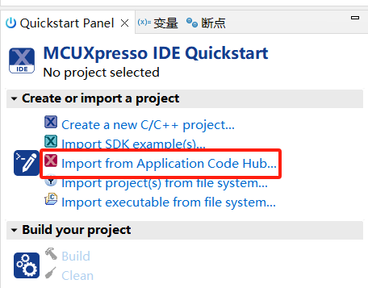

# NXP Application Code Hub

## AN14184 Using SmartDMA for Keyscan on MCX N Series MCU
This software accompanies application note AN14184.This application note mainly introduces the Keyscan solution for MCX N series MCU.

All MCX N series MCUs include a SmartDMA coprocessor, which can effectively reduce the load on the Arm core and perform fast I/O operations.

The Keyscan scheme has no fixed interface. It can be used for matrix scanning and for row or column scanning. The number of scanned keys can be one or from one to two hundreds. If it is a commonly used computer keyboard, it is generally 101 keys, 104 keys, or 87 keys. If it is a small keyboard, it is generally 4x4 to get 16 keys. It can also be used for irregular button matrix. In short, the button layout and the number of buttons can be customized. This application note uses a 4x4 matrix keyboard, however, the interface is not fully compatible, it only supports the determination of 2x4 with a total of 8 keys. To achieve the determination of 16 keys, the hardware should be reworked by some wires.

#### Boards: FRDM-MCXN947
#### Categories: HMI
#### Peripherals: GPIO
#### Toolchains: MCUXpresso IDE

## Table of Contents
1. [Software](#step1)
2. [Hardware](#step2)
3. [Setup](#step3)
4. [Results](#step4)
6. [Support](#step5)
7. [Release Notes](#step6)

## 1. Software
- [MCUXpresso IDE V11.10 or later](https://www.nxp.com/design/design-center/software/development-software/mcuxpresso-software-and-tools-/mcuxpresso-integrated-development-environment-ide:MCUXpresso-IDE).
- SDK_2_16_000_FRDM-MCXN947
- MCUXpresso for Visual Studio Code: This example supports MCUXpresso for Visual Studio Code, for more information about how to use Visual Studio Code please refer [here](https://www.nxp.com/design/training/getting-started-with-mcuxpresso-for-visual-studio-code:TIP-GETTING-STARTED-WITH-MCUXPRESSO-FOR-VS-CODE).

## 2. Hardware
- Type-C USB cable

- FRDM-MCXN947

- Personal Computer

- Key pad module: PmodKYPD board

  (it can be purchased through the website: https://store.digilentinc.com/pmod-kypd-16-button-keypad)

## 3. Setup
### 3.1 Step 1

Connect PmodKYPD board to J7 (PMOD header) of FRDM-MCXN947:

### 3.2 Step 2

- Import the project to MCUXpresso IDE.

1. Open MCUXpresso IDE, in the Quick Start Panel, choose **Import from Application Code Hub**.

   ​	

2. Enter the demo name in the search bar.

    

3. Click **Copy GitHub link**, MCUXpresso IDE will automatically retrieve project attributes, then click **Next>**.

   ​	

4. Select **main** branch and then click **Next>**, Select the MCUXpresso project, click **Finish** button to complete import.

   ​	

- Connect the micro USB cable between the PC host and the USB port (J17) on the board.

- Open a serial terminal on PC for the serial device with these settings:

    \- 115200 baud rate

    \- 8 data bits

    \- No parity

    \- One stop bit

    \- No flow control

- Compile and download to the board.

- Reset and run.

## 4. Results
1. The following lines are printed to the serial terminal when the demo program is executed.

 SmartDMA keyscan example

2. Press some button on PmodKYPD, the following lines are printed to the serial terminal:

   Button 2 is pressed 

   Button 1 is pressed 

   Button B is pressed 

   Button 6 is pressed 

   Button 5 is pressed 

## 5. Support
*Provide URLs for help here.*

#### Project Metadata

<!----- Boards ----->

<!----- Categories ----->

<!----- Peripherals ----->

<!----- Toolchains ----->

Questions regarding the content/correctness of this example can be entered as Issues within this GitHub repository.

>**Warning**: For more general technical questions regarding NXP Microcontrollers and the difference in expected functionality, enter your questions on the [NXP Community Forum](https://community.nxp.com/)

## 6. Release Notes
| Version | Description / Update                           | Date                        |
|:-------:|------------------------------------------------|----------------------------:|
| 1.0     | Initial release on Application Code Hub        | July 31st 2024 |

<small>
<b>Trademarks and Service Marks</b>: There are a number of proprietary logos, service marks, trademarks, slogans and product designations ("Marks") found on this Site. By making the Marks available on this Site, NXP is not granting you a license to use them in any fashion. Access to this Site does not confer upon you any license to the Marks under any of NXP or any third party's intellectual property rights. While NXP encourages others to link to our URL, no NXP trademark or service mark may be used as a hyperlink without NXP’s prior written permission. The following Marks are the property of NXP. This list is not comprehensive; the absence of a Mark from the list does not constitute a waiver of intellectual property rights established by NXP in a Mark.
</small>
 
<small>
NXP, the NXP logo, NXP SECURE CONNECTIONS FOR A SMARTER WORLD, Airfast, Altivec, ByLink, CodeWarrior, ColdFire, ColdFire+, CoolFlux, CoolFlux DSP, DESFire, EdgeLock, EdgeScale, EdgeVerse, elQ, Embrace, Freescale, GreenChip, HITAG, ICODE and I-CODE, Immersiv3D, I2C-bus logo , JCOP, Kinetis, Layerscape, MagniV, Mantis, MCCI, MIFARE, MIFARE Classic, MIFARE FleX, MIFARE4Mobile, MIFARE Plus, MIFARE Ultralight, MiGLO, MOBILEGT, NTAG, PEG, Plus X, POR, PowerQUICC, Processor Expert, QorIQ, QorIQ Qonverge, RoadLink wordmark and logo, SafeAssure, SafeAssure logo , SmartLX, SmartMX, StarCore, Symphony, Tower, TriMedia, Trimension, UCODE, VortiQa, Vybrid are trademarks of NXP B.V. All other product or service names are the property of their respective owners. © 2021 NXP B.V.
</small>